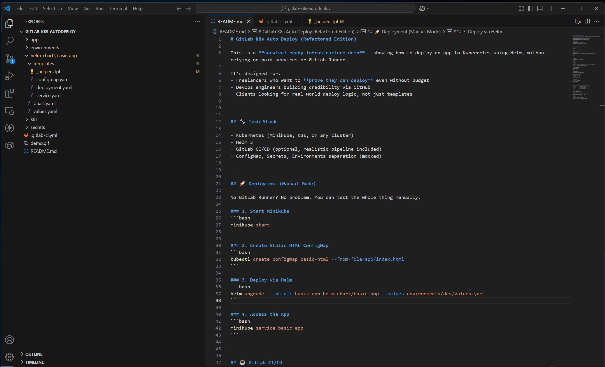

# GitLab K8s Auto Deploy

This project demonstrates how to deploy a basic static application to Kubernetes using Helm.  
Originally designed for GitLab CI/CD automation, but can also be run **manually** if no runner is available.

---

## 🔧 Stack

- Helm  
- Kubernetes (Minikube or K3s)  
- NGINX Static HTML App

---

## 🚀 How to Use (Manual)

You can test everything locally without GitLab Runner:

### 1. Start Minikube
```bash
minikube start
```

### 2. Create ConfigMap from HTML
```bash
kubectl create configmap basic-html --from-file=app/index.html
```

### 3. Deploy via Helm
```bash
helm upgrade --install basic-app ./helm-chart/basic-app
```

### 4. Access the App
```bash
minikube service basic-app
```

> You should see:  
> **"Hello from GitLab CI + Helm + K8s"**

---

## 📸 Demo (Manual Deploy Flow)



---

## 📂 Repo Structure

| Path               | Purpose                          |
|--------------------|----------------------------------|
| `.gitlab-ci.yml`   | Example CI/CD pipeline (optional)|
| `helm-chart/`      | Helm chart for the app           |
| `k8s/`             | Helper scripts (e.g. minikube)   |
| `app/`             | Static HTML app content          |

---

## 💬 Note

You can later hook this up to GitLab CI/CD by using `.gitlab-ci.yml` and running it on a Kubernetes-capable runner.

> ✅ If you can run this manually — you can deploy it in CI.  
> 🚫 No runner? No problem. Just prove it works.

---

## 🙏 Author

[Nuntin (GitHub)](https://github.com/Nuntin)  
Open to contract/freelance work — infrastructure setup, CI/CD pipelines, Kubernetes, and more.
